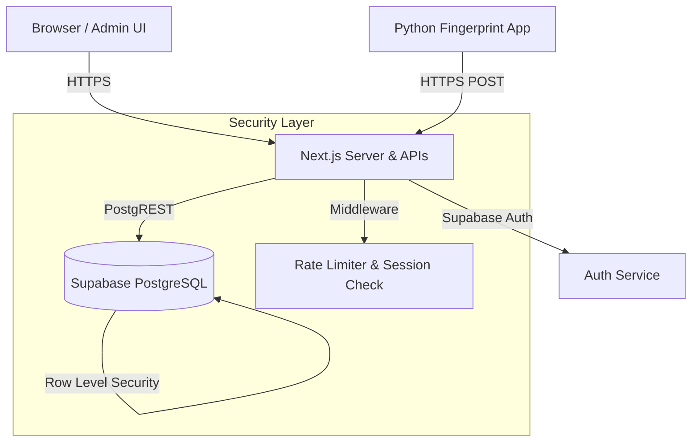

# 🏋️ GymFlow - Project Architecture & Big Picture

This document provides a comprehensive, high-level overview of the GymFlow application. It explains exactly what the project does, how the underlying systems communicate, and the detailed logic behind every module.

---

## 🏗️ Architecture Overview

GymFlow is a modern, full-stack Gym Management System. It uses a Next.js (React) front-end, serverless backend APIs, and a Supabase (PostgreSQL) database. It is also designed to integrate with a physical USB fingerprint scanner via a local Python bridge.

---

## 🔒 Security & Authentication (How it's secured)

Security is the backbone of GymFlow. The system uses a multi-layered defense architecture to ensure no unauthorized access or data tampering.

1. **Supabase Authentication**: The system uses Supabase Auth to manage the Admin credentials. 
2. **Next.js Edge Middleware (`src/middleware.ts`)**: 
   - Every request is intercepted at the edge. 
   - It checks for a valid session token in cookies. If the user isn't logged in, they are blocked (API returns `401 Unauthorized`) or redirected to `/login`.
   - **Rate Limiting**: It implements an in-memory token bucket that restricts users to 60 API requests per minute per IP address, preventing DDoS and brute-force attacks.
   - **Security Headers**: Injects Strict-Transport-Security (HSTS), X-Frame-Options (Clickjacking protection), and Referrer-Policy headers.
3. **Database Row Level Security (RLS)**: The Supabase database tables (`members`, `attendance`, `payments`) are completely locked down. The public anon key cannot read or write data. Instead, our Next.js backend uses a hidden `SERVICE_ROLE_KEY` to securely bypass RLS from within the protected server environment.

---

## 📦 Core Modules

### 1. Members Module (`/members`)
**What it does:** Manages the gym's user base, tracking personal details, membership numbers, and active/inactive statuses.
**How it works:**
- **Creation/Editing**: Admins can manually add members through a sleek modal (`MemberForm.tsx`). You can manually assign a membership number.
- **Data Flow**: The frontend sends a `POST` or `PUT` request to `/api/members`, which validates the payload and writes it directly to the Supabase `members` table.
- **Member Details Page**: Clicking the "Eye" icon opens a dedicated profile page (`/members/[id]`) that aggregates data from all three tables to show their complete history (Attendance records, Payment history, and Contact Info).

### 2. Attendance Module (`/attendance`)
**What it does:** Tracks daily gym check-ins and enforces the strict "10-day absence" rule.
**How it works:**
- **Manual/Automated Entry**: Attendance can be marked via the Admin UI, or via the Python Fingerprint app calling the `/api/fingerprint` endpoint.
- **The 10-Day Absence Rule**: 
  - When attendance is marked, the `/api/attendance` endpoint calculates the working days (excluding Sundays) between today and the member's joining date (or the start of the current month).
  - It subtracts the number of days the member actually attended.
  - If the member missed 10 or more days, the API rejects the attendance and flags the account as `requires_admin_review`.
- **Exemption Flow**: If blocked, the Admin can click "Exempt & Active" in the UI. This triggers `/api/members/[id]/exempt`, which updates a special `exemption_month` column on the member. Future attendance checks in that month will bypass the 10-day block.

### 3. Payments Module (`/payments`)
**What it does:** A complete financial dashboard tracking pending collections, monthly revenue, and receipt generation.
**How it works:**
- **Pending Logic**: The UI fetches all active members and all payments for the currently selected month. If a member does not have a corresponding payment record for that month, they are placed in the "Pending Collections" tab.
- **Recording Payments**: Clicking "Mark Paid" opens a modal. Submitting calls `/api/payments` (POST) to insert a row into the `payments` table linking the `member_id` with the `amount` and `month`.
- **Receipts**: Successful payments move to the "History" tab. Clicking the receipt icon opens a printable, formatted invoice utilizing the browser's native `window.print()` functionality with dedicated CSS print media queries.

### 4. Background Automation (Cron Jobs)
**What it does:** Automatically cleans up inactive accounts at the end of the month.
**How it works:**
- The `/api/cron/cleanup` endpoint is designed to be triggered by a cron service (like Vercel Cron or a GitHub Action).
- It queries the database for all members whose status is manually set to `Inactive`.
- It performs a hard deletion of these members from the system, keeping the database lean and saving on storage limits.

---

## 🚀 The Typical Admin Workflow

1. **Morning**: The Admin logs into `http://localhost:3000/login` securely.
2. **Throughout the day**: Members scan their fingerprints. The Python app sends a hidden API request to the protected backend. The database updates in real-time.
3. **Start of Month**: The Admin navigates to the **Payments** tab. They select the current month. The system instantly cross-references all active members against payment records and lists everyone who owes fees under "Pending Collections".
4. **Member Owes Fees**: The Admin clicks "Mark Paid", enters the cash received, and instantly prints a slick receipt.
5. **Absence Alert**: A member who hasn't shown up for 12 days tries to scan their finger. The scanner buzzes red. The Admin checks the dashboard, sees the 10-day block alert, and decides to "Exempt" the user so they can continue working out.

## 💻 Tech Stack Deep Dive
- **Frontend**: React 19 + Next.js App Router. Tailwind CSS for utility-first styling. Lucide-React for crisp, scalable icons.
- **Backend API**: Next.js Serverless Functions (`route.ts`).
- **Database**: Supabase (Hosted PostgreSQL) with auto-generated REST APIs.
- **Tooling**: TypeScript for end-to-end type safety, ensuring no runtime errors when accessing database fields.
